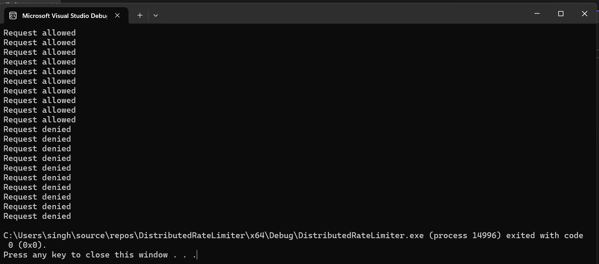

# Distributed Rate Limiter

## Table of Contents
1. [Introduction](#introduction)
2. [What is Rate Limiting?](#what-is-rate-limiting)
3. [Why Do We Need Rate Limiting?](#why-do-we-need-rate-limiting)
4. [Token Bucket Algorithm](#token-bucket-algorithm)
5. [Project Overview](#project-overview)
6. [Implementation](#implementation)
7. [Compilation and Execution](#compilation-and-execution)
8. [Screenshots](#screenshots)
9. [Future Enhancements](#future-enhancements)


## Introduction

Welcome to our Distributed Rate Limiter project! This project is an implementation of a rate limiting mechanism using the Token Bucket Algorithm.

## What is Rate Limiting?


Rate limiting is a technique used to control the rate at which requests are sent to a server, preventing overload and ensuring fair usage across a distributed system.

## Why Do We Need Rate Limiting?

Rate limiting is crucial in distributed systems to:

- **Prevent abuse**: By ensuring no one user or service can overload the system.
- **Ensure fair resource allocation**: Making sure resources are distributed fairly among users.
- **Improve system reliability**: Preventing crashes due to high load.

## Token Bucket Algorithm

The Token Bucket Algorithm is a widely used rate limiting technique.

### How it works:
- Tokens are added to the bucket at a constant rate.
- Each request consumes one token.
- If the bucket is empty, requests are denied.


## Project Overview

Our Distributed Rate Limiter project implements the Token Bucket Algorithm in C++ to control the flow of requests in a thread-safe manner.

### Features:
- **Token Bucket Algorithm**: Limits the rate of requests based on tokens added per second.
- **Dynamic Rate Limiting**: You can adjust the rate and burst size.
- **Thread-safe Design**: Utilizes mutexes for safe multi-threaded environments.

## Implementation

The rate limiter uses a token bucket algorithm to efficiently manage and control the rate at which requests are allowed. It ensures thread-safety using mutexes and provides dynamic control of tokens per second and burst size.

## Compilation and Execution

### Compile the code:
```bash
g++ -std=c++11 rate_limiter.cpp -o rate_limiter
```

### Run the executable:
```bash
./rate_limiter
```

## Screenshots
----------

Here is an example screenshot of the project in action:



## Future Enhancements
-------------------

* **Dynamic Rate Adjustment**: Implement rate adjustment based on traffic patterns and user load.
* **Web Integration**: Integrate with web frameworks like FastAPI, Django, or Flask for real-time API request limiting.
* **Persistent Token Tracking**: Implement persistent token tracking across distributed instances for better synchronization.
